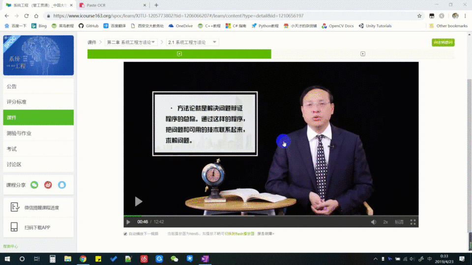
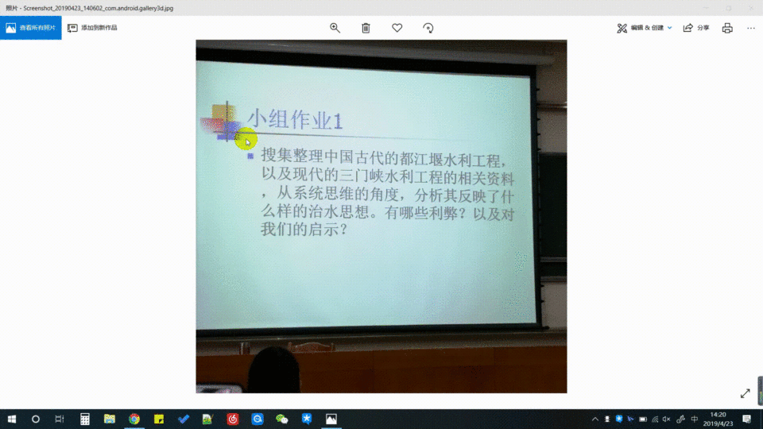
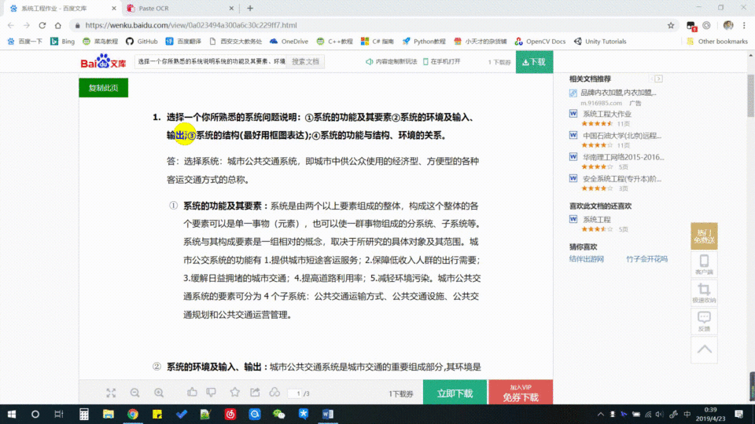

# 粘贴截图并进行文字识别
## 功能介绍
当我们使用QQ、Tim、微信或者电脑自身的截图功能获取了截图后，不需要将图片保存成文件，只需在页面中的输入框中直接使用Ctrl+V或者右键粘贴就能得到剪贴板中的图片了。同时，我们会将你粘贴的图片上传到后台，调用百度AI的OCR（文字识别）接口，将图片中的文字识别并提取出来，将识别结果显示到页面上。最后，你可是一手动修改你认为识别不正确的地方，然后点击下边的按钮一键复制所有的识别结果，粘贴到你想要粘贴的任何部分！

## 基本原理与流程
* 使用OCR接口前，需要先请求access_token，为了避免重复请求，将其保存在session中
* 使用JavaScript检测粘贴事件，并使用Clipboard技术获取剪贴板中的图片的Base64编码
* 显然，获取到的Base64编码是可以用来在页面中显示图片的
* 使用AJAX技术将Base64编码传送到后台
* 后台获取得到图片的Base64，进行预处理，包括去掉头部信息、将AJAX传送过程中自动转换的‘+’符号从空格转换回来等
* 将格式化好的图片的Base64编码请求百度的OCR接口返回文字识别结果
* 将多个零散的是被内容拼合成一个完整的字符串并返回给前端，显示在页面上
* 完成一键复制功能

## 实例与使用
本仓库中的代码省略了所有的样式，只保留了最简单的代码内容，一个比较好的可以运行的实例请参考笔者的个人项目。

也欢迎你收藏笔者的网站，随意使用，希望在一些情况下可以帮到你！

[笔者个人的项目实例](https://www.littlegenius.xin/PasteOCR/)

本项目申请使用了百度OCR接口中的“通用文字识别”接口，对于准确率来讲，个人使用基本满意，可以识别不是文字不是正向的图片（即文字方向旋转也生效），不能识别手写文字，每日识别次数上线为50000次。

如果你有任何提议或问题，欢迎使用邮件和我联系：<mhz2180572509@163.com>